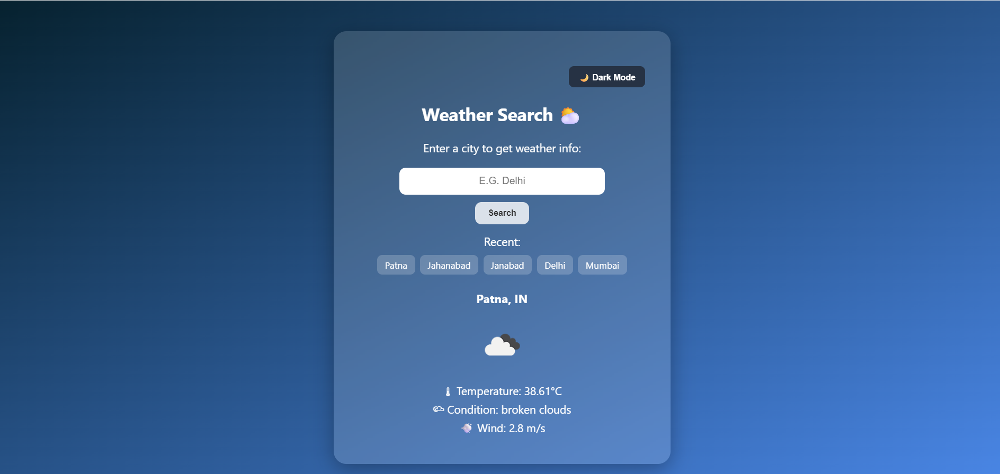

# 🌤️ React Weather App

A beautiful, animated, and fully responsive weather app built using **React** and the **OpenWeatherMap API**. Enter any city to get real-time weather updates with temperature, wind speed, condition, and icons — all displayed inside a modern glassmorphism card with subtle animations.

---

## 🚀 Features

- 🔍 City-based weather search
- 🌡️ Real-time temperature, condition, wind info
- 🌥️ Weather condition icons
- 🌈 Glassmorphism UI with smooth animations
- 📱 Fully responsive layout
- 🔄 Fade-in and hover animations
- 🧠 Optional: Theme toggle, recent search, PDF summary (you can add)

---

## 🛠️ Tech Stack

- **React JS**
- **Axios** for API calls
- **OpenWeatherMap API**
- **CSS3** with modern animations

---

## 🔧 Getting Started

### 1. Clone the repository

```bash
git clone https://github.com/your-username/react-weather-app.git
cd react-weather-app
src/
│
├── components/
│   └── WeatherBody.js         # Main weather component
│
├── App.js                     # Main entry component
├── index.js                   # React DOM entry point
├── weather_body.css           # CSS styles and animations
└── assets/                    # (Optional) background or weather icons


📷 Preview
```

